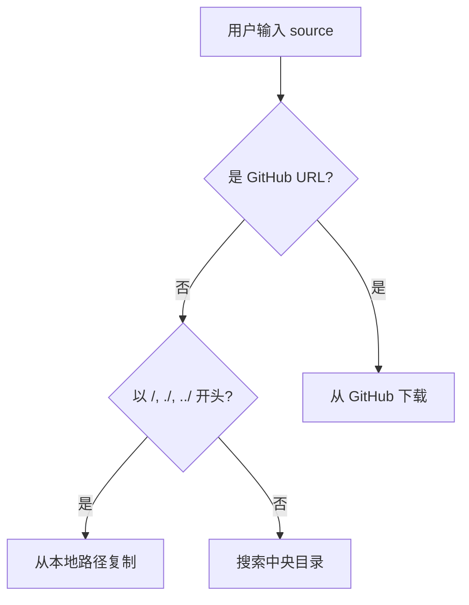

# skill-mgr

AI Agent Skills 管理工具，支持从 GitHub 或本地路径添加 skills 到中央仓库，并可选地创建符号链接到各 AI agent。

## 功能特性

- 🔗 **GitHub 集成**: 使用 git sparse-checkout 高效下载远程 skills
- 📁 **本地导入**: 支持从本地路径复制 skills
- 🔄 **符号链接管理**: 自动创建符号链接到指定 agents
- ✅ **智能验证**: 自动验证 SKILL.md 存在性
- 🎨 **友好交互**: 彩色输出和确认提示

## 安装

```bash
# 克隆或更新 linuxtools 仓库
cd ~/Projects/linuxtools

# 创建符号链接到 ~/bin
mkdir -p ~/bin
ln -sf $(pwd)/skill-mgr/skill_mgr.sh ~/bin/skill-mgr

# 确保 ~/bin 在 PATH 中
echo 'export PATH="$HOME/bin:$PATH"' >> ~/.bashrc  # 或 ~/.zshrc
source ~/.bashrc  # 或 source ~/.zshrc
```

## 使用方法

### 基本语法

```bash
skill-mgr add <source> [-a <agents...>]
```

### 参数说明

- `<source>`: Skill 来源，支持三种格式：
  - **GitHub URL**: `https://github.com/owner/repo/tree/branch/path/to/skill`
  - **本地路径**: `/path/to/skill` 或 `./skill` 或 `../skill`
    - **必须以 `/`, `./`, `../` 开头**，显式指定路径
    - 用于从本地文件系统复制 skill 到中央目录
  - **Skill 名称**: 直接输入 skill 名称（裸名称，无路径前缀）
    - 工具会在中央目录 `~/agent-settings/skills/` 中搜索
    - 支持精确匹配和模糊搜索
    - 多个匹配时会提示用户选择
    - 用于快速链接已存在的 skills 到不同 agents

- `-a <agents...>`: (可选) 指定要链接的 agents
  - 支持: `cursor`, `claude-code`, `codex`
  - 可以指定多个，用空格分隔
  - 不指定则仅下载到中央目录

### 使用示例

#### 1. 从 GitHub 添加 skill（仅下载）

```bash
skill-mgr add https://github.com/anthropics/skills/tree/main/skills/skill-creator
```

这会将 skill 下载到 `~/agent-settings/skills/skill-creator/`，但不创建任何符号链接。

#### 2. 从 GitHub 添加并链接到 cursor

```bash
skill-mgr add https://github.com/anthropics/skills/tree/main/skills/skill-creator -a cursor
```

这会：
1. 下载到 `~/agent-settings/skills/skill-creator/`
2. 创建符号链接: `~/.cursor/skills/skill-creator` → `~/agent-settings/skills/skill-creator`

#### 3. 从 GitHub 添加并链接到多个 agents

```bash
skill-mgr add https://github.com/anthropics/skills/tree/main/skills/pdf-editor -a cursor claude-code codex
```

这会创建符号链接到所有三个 agents 的 skills 目录。

#### 4. 从本地路径添加（必须使用显式路径前缀）

```bash
# 绝对路径
skill-mgr add /path/to/my-skill -a cursor
skill-mgr add ~/my-custom-skills/my-skill -a cursor

# 相对路径（当前目录）
skill-mgr add ./my-skill -a cursor

# 相对路径（上级目录）
skill-mgr add ../other-skills/my-skill -a cursor
```

**重要**：本地路径必须以 `/`, `./`, `../` 开头。如果当前目录有一个名为 `my-skill` 的文件夹，必须写 `./my-skill` 而不是 `my-skill`，否则会被识别为 skill 名称搜索。

#### 5. 使用 skill 名称搜索（智能搜索）

```bash
# 精确匹配
skill-mgr add skill-creator -a claude-code

# 模糊搜索（会找到 skill-creator 和 test-skill）
skill-mgr add skill -a cursor
# 输出：
# [INFO] 在中央 skills 目录搜索: skill
# [INFO] 找到多个匹配的 skills:
#   1) skill-creator
#   2) test-skill
# 请选择 (1-2, 或 0 取消): 

# 部分匹配
skill-mgr add creator -a cursor
# 会找到并使用 skill-creator
```

这个功能特别适合：
- 快速重新链接已下载的 skills 到不同的 agents
- 不记得完整 skill 名称时进行模糊搜索
- 在多个 skills 中快速选择

### 路径识别规则

工具会根据输入格式自动判断 source 类型：



| 输入格式 | 识别为 | 示例 | 说明 |
|---------|--------|------|------|
| `https://github.com/...` | GitHub URL | `https://github.com/anthropics/skills/tree/main/skills/skill-creator` | 从 GitHub 下载 |
| 以 `/` 开头 | 绝对路径 | `/Users/me/skills/my-skill` | 从绝对路径复制 |
| 以 `./` 开头 | 相对路径（当前） | `./my-skill` | 从当前目录复制 |
| 以 `../` 开头 | 相对路径（上级） | `../other/my-skill` | 从上级目录复制 |
| 其他（裸名称） | Skill 名称搜索 | `skill-creator` 或 `creator` | 搜索中央目录 |

**关键区别**：
- 如果当前目录有 `my-skill` 文件夹，输入 `my-skill` 会**搜索中央目录**
- 要使用当前目录的文件夹，必须输入 `./my-skill`

## 目录结构

### 中央存储

所有 skills 统一存储在:

```
~/agent-settings/skills/
├── skill-creator/
│   ├── SKILL.md
│   ├── scripts/
│   └── ...
├── pdf-editor/
│   └── ...
└── my-custom-skill/
    └── ...
```

### Agent 目录映射

| Agent | Skills 目录 |
|-------|-------------|
| cursor | `~/.cursor/skills/` |
| claude-code | `~/.claude/skills/` |
| codex | `~/.codex/skills/` |

符号链接示例:

```
~/.cursor/skills/skill-creator → ~/agent-settings/skills/skill-creator
~/.claude/skills/skill-creator → ~/agent-settings/skills/skill-creator
~/.codex/skills/skill-creator → ~/agent-settings/skills/skill-creator
```

## 工作原理

### GitHub 下载流程

1. **URL 解析**: 从 GitHub URL 提取 owner, repo, branch, path
2. **Sparse Checkout**: 使用 `git sparse-checkout` 只下载指定目录，避免下载整个仓库
3. **验证**: 检查 `SKILL.md` 文件是否存在
4. **复制**: 将 skill 复制到中央目录 `~/agent-settings/skills/`

### 符号链接管理

- 自动检测目标目录是否存在
- 覆盖前提示确认
- 支持同时链接到多个 agents
- 使用 `ln -sf` 创建强制符号链接

## 依赖要求

- `git` (用于 GitHub 下载)
- `bash` 4.0+
- 标准 Unix 工具: `cp`, `ln`, `mkdir`, `basename`

## 常见问题

### 1. Skill 已存在如何处理？

工具会提示确认是否覆盖:

```
[WARN] Skill 已存在: /Users/xxx/agent-settings/skills/skill-creator
是否覆盖? (y/N)
```

### 2. Agent 目录不存在怎么办？

工具会跳过该 agent 并显示警告:

```
[WARN] Agent 目录不存在: /Users/xxx/.claude/skills
[WARN] 跳过 claude-code
```

### 3. 如何验证 skill 是否安装成功？

检查中央目录:

```bash
ls -la ~/agent-settings/skills/
```

检查 agent 目录的符号链接:

```bash
ls -la ~/.cursor/skills/
ls -la ~/.claude/skills/
ls -la ~/.codex/skills/
```

## 贡献

欢迎提交 Issue 和 Pull Request！

## 相关链接

- [Anthropic Skills 仓库](https://github.com/anthropics/skills)
- [Skill Creator 文档](https://github.com/anthropics/skills/tree/main/skills/skill-creator)
